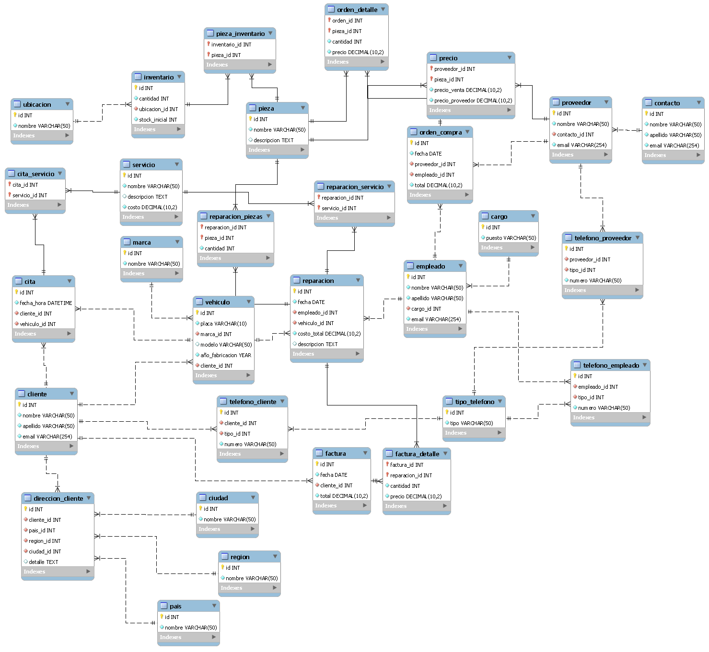

# Diseño Automotriz | Proyecto mySQL | Juan Diego Contreras Melendez

#### DDL.sql Comandos de creacion de tablas Y DML.sql Comandos de Inserción de datos

## Modelo Conceptual


## Modelo Lógico


## Modelo Físico

```mysql
-- #########################################################################
-- #### COMANDOS DDL CREACION DE TABLAS | Juan Diego Contreras ##################
-- ######################################################################
-- Este archivo realiza la creacion de las tablas necesarias 
-- para el funcionamiento de la base de datos de taller automotriz

-- Creacion de base de datos
DROP DATABASE IF EXISTS automotriz_db;
CREATE DATABASE automotriz_db;

-- Seleccion de base de datos
USE automotriz_db;

CREATE TABLE pais (
	id INT NOT NULL AUTO_INCREMENT,
	nombre VARCHAR(50) NOT NULL,
	CONSTRAINT PK_Pais_Id PRIMARY KEY(id)
)ENGINE=InnoDB;

CREATE TABLE region (
	id INT NOT NULL AUTO_INCREMENT,
	nombre VARCHAR(50) NOT NULL,
	CONSTRAINT PK_Region_Id PRIMARY KEY(id)
)ENGINE=InnoDB;

CREATE TABLE ciudad (
	id INT NOT NULL AUTO_INCREMENT,
	nombre VARCHAR(50) NOT NULL,
	CONSTRAINT PK_Ciudad_Id PRIMARY KEY(id)
)ENGINE=InnoDB;

-- Creación de la tabla cliente
CREATE TABLE cliente (
    id INT NOT NULL AUTO_INCREMENT,
    nombre VARCHAR(50) NOT NULL,
    apellido VARCHAR(50) NOT NULL,
    email VARCHAR(254) NOT NULL UNIQUE,
    CONSTRAINT PK_Cliente_Id PRIMARY KEY(id)
)ENGINE=InnoDB;

-- Creación de la tabla direccion_cliente
CREATE TABLE direccion_cliente (
	id INT NOT NULL AUTO_INCREMENT,
	cliente_id INT NOT NULL,
	pais_id INT NOT NULL,
	region_id INT NOT NULL,
	ciudad_id INT NOT NULL,
	detalle TEXT NULL,
	CONSTRAINT PK_DireccionCliente_Id PRIMARY KEY(id),
	CONSTRAINT FK_Cliente_DireccionCliente_Id FOREIGN KEY(cliente_id) REFERENCES cliente(id),
	CONSTRAINT FK_Pais_DireccionCliente_Id FOREIGN KEY(pais_id) REFERENCES pais(id),
	CONSTRAINT FK_Region_DireccionCliente_Id FOREIGN KEY(region_id) REFERENCES region(id),
	CONSTRAINT FK_Ciudad_DireccionCliente_Id FOREIGN KEY(ciudad_id) REFERENCES ciudad(id)
)ENGINE=InnoDB;

-- Creación de la tabla tipo_telefono
CREATE TABLE tipo_telefono (
	id INT NOT NULL AUTO_INCREMENT,
	tipo VARCHAR(50) NOT NULL,
	CONSTRAINT PK_tipoTelefono_Id PRIMARY KEY(id)
)ENGINE=InnoDB;

-- Creación de la tabla telefono_cliente
CREATE TABLE telefono_cliente (
	id INT NOT NULL AUTO_INCREMENT,
	cliente_id INT NOT NULL,
	tipo_id INT NOT NULL,
	numero VARCHAR(50) NOT NULL,
	CONSTRAINT PK_TelefonoCliente_Id PRIMARY KEY(id),
	CONSTRAINT FK_Cliente_TelefonoCliente_Id FOREIGN KEY(cliente_id) REFERENCES cliente(id),
	CONSTRAINT FK_Tipo_TelefonoCliente_Id FOREIGN KEY(tipo_id) REFERENCES tipo_telefono(id)
)ENGINE=InnoDB;

-- Creación de la tabla marca
CREATE TABLE marca(
    id INT NOT NULL AUTO_INCREMENT,
    nombre VARCHAR(50) NOT NULL,
    CONSTRAINT PK_Marca_Id PRIMARY KEY(id)
)ENGINE=InnoDB;

-- Creación de la tabla vehiculo
CREATE TABLE vehiculo (
    id INT NOT NULL AUTO_INCREMENT,
    placa VARCHAR(10) NOT NULL UNIQUE,
    marca_id INT NOT NULL,
    modelo VARCHAR(50) NULL ,
    año_fabricacion YEAR NOT NULL,
    cliente_id INT NOT NULL,
    CONSTRAINT PK_Vehiculo_Id PRIMARY KEY (id),
    CONSTRAINT FK_Marca_Vehiculo_Id FOREIGN KEY (marca_id) REFERENCES marca(id),
	CONSTRAINT FK_Cliente_Vehiculo_Id FOREIGN KEY (cliente_id) REFERENCES cliente(id)
)ENGINE=InnoDB;

-- Creación de la tabla servicio
CREATE TABLE servicio (
    id INT NOT NULL AUTO_INCREMENT,
    nombre VARCHAR(50) NOT NULL,
    descripcion TEXT NULL,
    costo DECIMAL(10, 2) NOT NULL,
    CONSTRAINT PK_Servicio_Id PRIMARY KEY(id)
)ENGINE=InnoDB;

-- Creación de la tabla cargo
CREATE TABLE cargo(
	id INT NOT NULL AUTO_INCREMENT,
	puesto VARCHAR(50) NOT NULL,
    CONSTRAINT PK_Cargo_Id PRIMARY KEY(id)
)ENGINE=InnoDB;

-- Creación de la tabla empleado
CREATE TABLE empleado (
    id INT NOT NULL AUTO_INCREMENT,
    nombre VARCHAR(50) NOT NULL,
    apellido VARCHAR(50) NOT NULL,
    cargo_id INT NOT NULL,
    email VARCHAR(254) NOT NULL,
    CONSTRAINT PK_Empleado_Id PRIMARY KEY (id),
    CONSTRAINT FK_Cargo_Empleado_Id FOREIGN KEY (cargo_id) REFERENCES cargo(id)
)ENGINE=InnoDB;

-- Creación de la tabla telefono_empleado
CREATE TABLE telefono_empleado (
	id INT NOT NULL AUTO_INCREMENT,
	empleado_id INT NOT NULL,
	tipo_id INT NOT NULL,
	numero VARCHAR(50) NOT NULL,
	CONSTRAINT PK_TelefonoEmpleado_Id PRIMARY KEY(id),
	CONSTRAINT FK_Empleado_TelefonoEmpleado_Id FOREIGN KEY(empleado_id) REFERENCES empleado(id),
	CONSTRAINT FK_Tipo_TelefonoEmpleado_Id FOREIGN KEY(tipo_id) REFERENCES tipo_telefono(id)
)ENGINE=InnoDB;

-- Creación de la tabla reparacion
CREATE TABLE reparacion (
    id INT NOT NULL AUTO_INCREMENT,
    fecha DATE NOT NULL,
    empleado_id INT NOT NULL,
    vehiculo_id INT NOT NULL,
    costo_total DECIMAL(10, 2) NOT NULL,
    descripcion TEXT NULL,
    CONSTRAINT PK_Reparacion_Id PRIMARY KEY (id),
    CONSTRAINT FK_Empleado_Reparacion_Id FOREIGN KEY (empleado_id) REFERENCES empleado(id),
    CONSTRAINT FK_Vehiculo_Reparacion_Id FOREIGN KEY (vehiculo_id) REFERENCES vehiculo(id)
)ENGINE=InnoDB;

-- Creación de la tabla intermedia reparacion_servicio
CREATE TABLE reparacion_servicio(
	reparacion_id INT NOT NULL,
	servicio_id INT NOT NULL,
	CONSTRAINT PK_Reparacion_Id PRIMARY KEY(reparacion_id, servicio_id),
	CONSTRAINT FK_Reparacion_ReparacionServicio_Id FOREIGN KEY (reparacion_id) REFERENCES reparacion(id),
	CONSTRAINT FK_Servicio_ReparacionServicio_Id FOREIGN KEY (servicio_id) REFERENCES servicio(id)
)ENGINE=InnoDB;

-- Creación de la tabla contacto
CREATE TABLE contacto (
	id INT NOT NULL AUTO_INCREMENT,
	nombre VARCHAR(50) NOT NULL,
	apellido VARCHAR(50) NOT NULL,
	email VARCHAR(254) NOT NULL,
	CONSTRAINT PK_Contacto_Id PRIMARY KEY(id)
)ENGINE=InnoDB;


-- Creación de la tabla proveedor
CREATE TABLE proveedor (
    id INT AUTO_INCREMENT NOT NULL,
    nombre VARCHAR(50) NOT NULL,
    contacto_id INT NOT NULL,
    email VARCHAR(254) NOT NULL,
    CONSTRAINT PK_Proveedor_Id PRIMARY KEY (id),
    CONSTRAINT FK_Contacto_Proveedor_Id FOREIGN KEY (contacto_id) REFERENCES contacto(id)
)ENGINE=InnoDB;

-- Creación de la tabla telefono_proveedor
CREATE TABLE telefono_proveedor (
	id INT AUTO_INCREMENT NOT NULL,
	proveedor_id INT NOT NULL,
	tipo_id INT NOT NULL,
	numero VARCHAR(50) NOT NULL,
	CONSTRAINT PK_TelefonoProveedor_Id PRIMARY KEY(id),
	CONSTRAINT FK_Proveedor_TelefonoProveedor_Id FOREIGN KEY(proveedor_id) REFERENCES proveedor(id),
	CONSTRAINT FK_Tipo_TelefonoProveedor_Id FOREIGN KEY(tipo_id) REFERENCES tipo_telefono(id)
)ENGINE=InnoDB;

-- Creación de la tabla pieza
CREATE TABLE pieza (
    id INT AUTO_INCREMENT NOT NULL,
    nombre VARCHAR(50) NOT NULL,
    descripcion TEXT NULL,
    CONSTRAINT PK_Pieza_Id PRIMARY KEY (id)
)ENGINE=InnoDB;

-- Creación de la tabla intermedia precio
CREATE TABLE precio (
	proveedor_id INT NOT NULL,
	pieza_id INT NOT NULL,
	precio_venta DECIMAL(10, 2) NOT NULL,
	precio_proveedor DECIMAL(10, 2) NOT NULL,
	CONSTRAINT PK_Precio_Id PRIMARY KEY (proveedor_id, pieza_id),
	CONSTRAINT FK_Proveedor_Precio_Id FOREIGN KEY(proveedor_id) REFERENCES proveedor(id),
	CONSTRAINT FK_Pieza_Precio_Id FOREIGN KEY (pieza_id) REFERENCES pieza(id)
)ENGINE=InnoDB;

-- Creación de la tabla intermedia reparacion_piezas
CREATE TABLE reparacion_piezas(
    reparacion_id INT NOT NULL,
    pieza_id INT NOT NULL,
    cantidad INT NOT NULL,
    CONSTRAINT PK_ReparacionPieza_Id PRIMARY KEY (reparacion_id, pieza_id),
    CONSTRAINT FK_Reparacion_ReparacionPieza_Id FOREIGN KEY (reparacion_id) REFERENCES reparacion(id),
    CONSTRAINT FK_Pieza_ReparacionPieza_Id FOREIGN KEY (pieza_id) REFERENCES pieza(id)
)ENGINE=InnoDB;

-- Creación de la tabla cita
CREATE TABLE cita (
    id INT AUTO_INCREMENT NOT NULL,
    fecha_hora DATETIME NOT NULL,
    cliente_id INT NOT NULL,
    vehiculo_id INT NOT NULL,
    CONSTRAINT PK_Cita_Id PRIMARY KEY (id),
    CONSTRAINT FK_Cliente_Cita_Id FOREIGN KEY (cliente_id) REFERENCES cliente(id),
    CONSTRAINT FK_Vehiculo_Cita_Id FOREIGN KEY (vehiculo_id) REFERENCES vehiculo(id)
)ENGINE=InnoDB;

-- Creación de la tabla intermedia cita_servicio
CREATE TABLE cita_servicio (
	cita_id INT NOT NULL,
	servicio_id INT NOT NULL,
	CONSTRAINT PK_CitaServicio_Id PRIMARY KEY (cita_id, servicio_id),
	CONSTRAINT FK_Cita_CitaServicio_Id FOREIGN KEY (cita_id) REFERENCES cita(id),
	CONSTRAINT FK_Servicio_CitaServicio_Id FOREIGN KEY (servicio_id) REFERENCES servicio(id)
)ENGINE=InnoDB;

-- Creación de la tabla ubicacion
CREATE TABLE ubicacion (
	id INT AUTO_INCREMENT NOT NULL,
	nombre VARCHAR(50) NOT NULL,
	CONSTRAINT PK_Ubicacion_Id PRIMARY KEY(id)
)ENGINE=InnoDB;

-- Creación de la tabla inventario
CREATE TABLE inventario (
    id INT AUTO_INCREMENT NOT NULL,
    cantidad INT NOT NULL,
    ubicacion_id INT NOT NULL,
    stock_inicial INT NOT NULL,
    CONSTRAINT PK_Inventario_Id PRIMARY KEY (id),
    CONSTRAINT FK_Ubicacion_Inventario_Id FOREIGN KEY (ubicacion_id) REFERENCES ubicacion(id)
)ENGINE=InnoDB;

-- Creación de la tabla intermedia pieza_inventario
CREATE TABLE pieza_inventario(
	inventario_id INT NOT NULL,
	pieza_id INT NOT NULL,
	CONSTRAINT PK_PiezaInventario_Id PRIMARY KEY(inventario_id, pieza_id),
	CONSTRAINT FK_Inventario_PiezaInventario_Id FOREIGN KEY (inventario_id) REFERENCES inventario(id),
    CONSTRAINT FK_Pieza_PiezaInventario_Id FOREIGN KEY (pieza_id) REFERENCES pieza(id)
)ENGINE=InnoDB;

-- Creación de la tabla orden_compra
CREATE TABLE orden_compra (
    id INT AUTO_INCREMENT NOT NULL,
    fecha DATE NOT NULL,
    proveedor_id INT NOT NULL,
    empleado_id INT NOT NULL,
    total DECIMAL(10, 2) NOT NULL,
    CONSTRAINT PK_OrdenCompra_Id PRIMARY KEY (id),
    CONSTRAINT FK_Proveedor_OrdenCompra_Id FOREIGN KEY (proveedor_id) REFERENCES proveedor(id),
    CONSTRAINT FK_Empleado_OrdenCompra_Id FOREIGN KEY (empleado_id) REFERENCES empleado(id)
)ENGINE=InnoDB;

-- Creación de la tabla intermedia orden_detalle
CREATE TABLE orden_detalle (
    orden_id INT NOT NULL,
    pieza_id INT NOT NULL,
    cantidad INT NOT NULL,
    precio DECIMAL(10, 2) NOT NULL,
    CONSTRAINT PK_OrdenDetalle_Id PRIMARY KEY (orden_id, pieza_id),
    CONSTRAINT FK_OrdenCompra_OrdenDetalle_Id FOREIGN KEY (orden_id) REFERENCES orden_compra(id),
    CONSTRAINT FK_Pieza_OrdenDetalle_Id FOREIGN KEY (pieza_id) REFERENCES pieza(id)
)ENGINE=InnoDB;

-- Creación de la tabla factura
CREATE TABLE factura (
    id INT AUTO_INCREMENT NOT NULL,
    fecha DATE NOT NULL,
    cliente_id INT NOT NULL,
    total DECIMAL(10, 2) NOT NULL,
    CONSTRAINT PK_Factura_Id PRIMARY KEY (id),
    CONSTRAINT FK_Cliente_Factura_Id FOREIGN KEY (cliente_id) REFERENCES cliente(id)
)ENGINE=InnoDB;

-- Creación de la tabla intermedia factura_detalle
CREATE TABLE factura_detalle (
    factura_id INT NOT NULL,
    reparacion_id INT NOT NULL,
    cantidad INT NOT NULL,
    precio DECIMAL(10, 2) NOT NULL,
    CONSTRAINT PK_FacturaDetalle_Id PRIMARY KEY (factura_id, reparacion_id),
    CONSTRAINT FK_Factura_FacturaDetalle_Id FOREIGN KEY (factura_id) REFERENCES factura(id),
    CONSTRAINT FK_Reparacion_FacturaDetalle_Id FOREIGN KEY (reparacion_id) REFERENCES reparacion(id)
)ENGINE=InnoDB;

-- Juan Diego Contreras - C.C: 1.***.***.782
```

## Tablas Base de datos

```
+-------------------------+
| Tables_in_automotriz_db |
+-------------------------+
| cargo                   |
| cita                    |
| cita_servicio           |
| ciudad                  |
| cliente                 |
| contacto                |
| direccion_cliente       |
| empleado                |
| factura                 |
| factura_detalle         |
| inventario              |
| marca                   |
| orden_compra            |
| orden_detalle           |
| pais                    |
| pieza                   |
| pieza_inventario        |
| precio                  |
| proveedor               |
| region                  |
| reparacion              |
| reparacion_piezas       |
| reparacion_servicio     |
| servicio                |
| telefono_cliente        |
| telefono_empleado       |
| telefono_proveedor      |
| tipo_telefono           |
| ubicacion               |
| vehiculo                |
+-------------------------+
30 rows in set (0.00 sec)
```

## Modelo Relacional



## Consultas requeridas

1. Obtener el historial de reparaciones de un vehículo específico

   ```mysql
   SELECT
    r.fecha,
    v.placa AS Placa_vehiculo,
    CONCAT(e.nombre,' ',e.apellido) AS Empleado_Asignado,
    r.costo_total AS Costo_Reparacion,
    r.descripcion AS Detalles
   FROM reparacion AS r
   JOIN vehiculo AS v ON v.id = r.vehiculo_id
   JOIN marca AS m ON m.id = v.marca_id
   JOIN empleado AS e ON e.id = r.empleado_id
   WHERE v.placa = 'MNO345';
   +------------+----------------+--------------------+------------------+------------------------------------------+
   | fecha      | Placa_vehiculo | Empleado_Asignado  | Costo_Reparacion | Detalles                                 |
   +------------+----------------+--------------------+------------------+------------------------------------------+
   | 2024-05-25 | MNO345         | David Gutiérrez    |            49.99 | Encerado del vehículo                    |
   | 2022-09-24 | MNO345         | Carolina González  |            19.99 | Detalle de tapetes y ventanas EXTERIORES |
   +------------+----------------+--------------------+------------------+------------------------------------------+
   -- En esta consulta selecciono el vehiculo con placa MNO345 y me muestra el historial de reparaciones del respectivo vehiculo
   ```

2. Calcular el costo total de todas las reparaciones realizadas por un empleado
    específico en un período de tiempo

  ```mysql
  SELECT 
    CONCAT(e.nombre, ' ', e.apellido) AS Empleado,
    SUM(r.costo_total)
  FROM empleado AS e
  JOIN reparacion AS r ON r.empleado_id = e.id
  WHERE e.id=5
  GROUP BY e.id;
  +------------------+--------------------+
  | Empleado         | SUM(r.costo_total) |
  +------------------+--------------------+
  | David Gutiérrez  |              89.98 |
  +------------------+--------------------+
  -- En esta consulta seleciono el empleado con id = 5 y consulto la suma total del dinero recaudado en las reparaciones hechas por este empleado
  ```

3. Listar todos los clientes y los vehículos que poseen
    Diseño Automotriz

  ```mysql
  SELECT
    CONCAT(c.nombre, ' ', c.apellido) AS cliente, 
    v.placa
  FROM vehiculo AS v
  JOIN cliente AS c ON c.id = v.cliente_id
  ORDER BY c.nombre ASC;
  +------------------+--------+
  | cliente          | placa  |
  +------------------+--------+
  | Ana Martínez     | JKL012 |
  | Andrés Guerrero  | CDE567 |
  | Carlos García    | GHI789 |
  | David Sánchez    | YZA567 |
  | Elena Rojas      | TUV678 |
  | Isabel Castro    | NOP012 |
  | Jorge Díaz       | EFG123 |
  | José Rodríguez   | STU901 |
  | Juan Pérez       | ABC123 |
  | Julia Iglesias   | FGH890 |
  | Laura González   | PQR678 |
  | Lucía Ramírez    | BCD890 |
  | Luis Hernández   | MNO345 |
  | Manuel Mendoza   | WXY901 |
  | María López      | DEF456 |
  | Marta Fernández  | VWX234 |
  | Miguel Vásquez   | KLM789 |
  | Pedro Moreno     | QRS345 |
  | Rosa Ortiz       | ZAB234 |
  | Sofía Torres     | HIJ456 |
  +------------------+--------+
  -- En esta consulta simplemente listo los clientes y sus respectivos vehiculos guiandome en la placa
  ```

4. Obtener la cantidad de piezas en inventario para cada pieza

   ```mysql
   SELECT
    p.nombre AS Pieza,
    i.cantidad AS Cantidad
   FROM pieza_inventario AS pi
   JOIN pieza AS p ON p.id = pi.pieza_id
   JOIN inventario AS i on i.id = pi.inventario_id
   ORDER BY i.cantidad ASC;
   +-------------------------+----------+
   | Pastillas de Freno      |       50 |
   | Radiador                |       50 |
   | Correa de Distribución  |       75 |
   | Sensor de Oxígeno       |       75 |
   | Filtro de Aceite        |      100 |
   | Amortiguador            |      100 |
   | Bobina de Encendido     |      150 |
   | Junta de Culata         |      150 |
   | Bujía de Encendido      |      200 |
   | Bomba de Agua           |      200 |
   +-------------------------+----------+
   -- En esta consulta me centro en la tabla intermedia y de ahi mediante JOIN me dirijo a las otras dos tablas para sacar cantidad de piezas y el nombre de la pieza
   ```

5. Obtener las citas programadas para un día específico

   ```mysql
   SELECT 
    CONCAT(cli.nombre, ' ', cli.apellido) AS Cliente,
    v.placa AS placa_vehiculo,
    c.fecha_hora
   FROM cita AS c
   JOIN cliente AS cli ON cli.id = c.cliente_id
   JOIN vehiculo AS v ON v.id = c.vehiculo_id
   WHERE DATE_FORMAT(fecha_hora, '%d') = '18';
   +------------------+----------------+---------------------+
   | Cliente          | placa_vehiculo | fecha_hora          |
   +------------------+----------------+---------------------+
   | Luis Hernández   | MNO345         | 2024-06-18 13:00:00 |
   | Luis Hernández   | HIJ456         | 2024-04-18 08:00:00 |
   | José Rodríguez   | DEF456         | 2024-03-18 08:00:00 |
   +------------------+----------------+---------------------+
   -- En esta consulta se listan las citas programadas para para el dia = 18 de cualquier mes
   ```

6. Generar una factura para un cliente específico en una fecha determinada

   ```mysql
   SELECT 
    f.id AS factura_id,
    CONCAT(c.nombre, ' ', c.apellido) AS Cliente,
    f.fecha AS fecha_factura,
    f.total AS total_a_pagar
   FROM factura AS f
   JOIN cliente AS c ON c.id = f.cliente_id
   WHERE f.fecha = '2024-06-15' AND f.cliente_id = 1;
   +------------+-------------+---------------+---------------+
   | factura_id | Cliente     | fecha_factura | total_a_pagar |
   +------------+-------------+---------------+---------------+
   |          1 | Juan Pérez  | 2024-06-15    |        300.00 |
   +------------+-------------+---------------+---------------+
   -- Esta consulta muestra la factura de una fecha especifica que en este caso es fecha = '2024-06-15' y cliente_id = 1
   ```

   

7. Listar todas las órdenes de compra y sus detalles

   ```mysql
   SELECT 
    od.orden_id AS orden_id,
    p.nombre AS Pieza,
    od.cantidad,
    od.precio
   FROM orden_detalle AS od
   JOIN pieza AS p ON p.id = od.pieza_id;
   | orden_id | Pieza                   | cantidad | precio |
   +----------+-------------------------+----------+--------+
   |        1 | Filtro de Aceite        |       10 |  15.00 |
   |        1 | Pastillas de Freno      |        5 |  25.00 |
   |        2 | Correa de Distribución  |       20 |  10.00 |
   |        2 | Bujía de Encendido      |       15 |  30.00 |
   |        3 | Bobina de Encendido     |        8 |  20.00 |
   +----------+-------------------------+----------+--------+
   -- En esta consulta listo la orden de compra con sus detalles, cantidad,precio y pieza
   ```

8. Obtener el costo total de piezas utilizadas en una reparación específica

   ```mysql
   SELECT 
   	rp.reparacion_id,
   	p.nombre AS Pieza,
   	rp.cantidad AS Cantidad_Piezas,
   	SUM(rp.cantidad * pre.precio_proveedor) AS costo_total_piezas
   FROM reparacion_piezas AS rp
   JOIN pieza AS p ON p.id = rp.pieza_id
   JOIN precio AS pre ON pre.pieza_id = rp.pieza_id
   WHERE rp.reparacion_id = 4
   GROUP BY rp.reparacion_id, p.nombre, rp.cantidad;
   +---------------+--------------------+-----------------+--------------------+
   | reparacion_id | Pieza              | Cantidad_Piezas | costo_total_piezas |
   +---------------+--------------------+-----------------+--------------------+
   |             4 | Bujía de Encendido |               4 |              23.00 |
   +---------------+--------------------+-----------------+--------------------+
   -- En esta consulta listo la reparacion con id = 4 en la cual se utiliza 4 bujias de encendido para dar un total de 23.00 esto basado en el costo_proveedor de la tabla precio
   ```

9. Obtener el inventario de piezas que necesitan ser reabastecidas (cantidad
    menor que un umbral)

  ```mysql
  SELECT 
  	p.nombre AS Pieza, 		
  	i.cantidad AS Cantidad,
  	i.id AS inventario_id,
  	u.nombre AS Ubicacion_inventario
  FROM pieza AS p
  JOIN pieza_inventario AS pi ON pi.pieza_id = p.id
  JOIN inventario AS i ON i.id = pi.inventario_id
  JOIN ubicacion AS u ON u.id = i.ubicacion_id
  WHERE i.cantidad < 100;
  +------------------------+----------+---------------+----------------------+
  | Pieza                  | Cantidad | inventario_id | Ubicacion_inventario |
  +------------------------+----------+---------------+----------------------+
  | Pastillas de Freno     |       50 |             2 | Depósito de Piezas   |
  | Radiador               |       50 |             2 | Depósito de Piezas   |
  | Correa de Distribución |       75 |             3 | Almacén de Repuestos |
  | Sensor de Oxígeno      |       75 |             3 | Almacén de Repuestos |
  +------------------------+----------+---------------+----------------------+
  -- En esta consulta selecciono que todos los inventarios con una cantidad de piezas menor que 100 debe ser restablecida y listo las piezas 
  ```

10. Obtener la lista de servicios más solicitados en un período específico

    ```mysql
    SELECT 
    	s.nombre AS Servicio,
    	COUNT(rs.servicio_id) AS Cantidad_Solicitada
    FROM reparacion_servicio AS rs
    JOIN servicio AS s ON s.id = rs.servicio_id
    JOIN reparacion AS r ON r.id = rs.reparacion_id
    WHERE  r.fecha BETWEEN '2024-05-14' AND '2024-05-30'
    GROUP BY s.nombre
    ORDER BY Cantidad_Solicitada DESC
    LIMIT 3;
    +------------------------+---------------------+
    | Servicio               | Cantidad_Solicitada |
    +------------------------+---------------------+
    | Detalle de Exteriores  |                   4 |
    | Rotación de Neumáticos |                   1 |
    | Cambio de Batería      |                   1 |
    +------------------------+---------------------+
    -- Esta consulta lista los servicios mas solicitados entre el periodo de 2024-05-14 hasta 2024-05-30
    ```

11. Obtener el costo total de reparaciones para cada cliente en un período
    específico

    ```mysql
    SELECT 
    	CONCAT(cli.nombre, ' ', cli.apellido) AS Cliente,
    	v.placa AS Placa_Vehiculo,
    	r.id AS Reparacion_id,
    	r.fecha AS Fecha_Reparacion,
    	SUM(r.costo_total) AS Costo_total_cliente
    FROM reparacion AS r
    JOIN vehiculo AS v ON v.id = r.vehiculo_id
    JOIN cliente AS cli ON cli.id = v.cliente_id
    WHERE  r.fecha BETWEEN '2024-05-14' AND '2024-05-30'
    GROUP BY r.id;
    +-----------------+----------------+---------------+------------------+---------------------+
    | Cliente         | Placa_Vehiculo | Reparacion_id | Fecha_Reparacion | Costo_total_cliente |
    +-----------------+----------------+---------------+------------------+---------------------+
    | Isabel Castro   | NOP012         |             1 | 2024-05-14       |               99.99 |
    | Pedro Moreno    | QRS345         |             2 | 2024-05-15       |               79.99 |
    | Elena Rojas     | TUV678         |             3 | 2024-05-16       |              149.99 |
    | Manuel Mendoza  | WXY901         |             4 | 2024-05-17       |              199.99 |
    | Rosa Ortiz      | ZAB234         |             5 | 2024-05-18       |               29.99 |
    | Andrés Guerrero | CDE567         |             6 | 2024-05-19       |              129.99 |
    | Julia Iglesias  | FGH890         |             7 | 2024-05-20       |              299.99 |
    | Juan Pérez      | ABC123         |             8 | 2024-05-21       |              399.99 |
    | María López     | DEF456         |             9 | 2024-05-22       |               19.99 |
    | Carlos García   | GHI789         |            10 | 2024-05-23       |               24.99 |
    | Ana Martínez    | JKL012         |            11 | 2024-05-24       |               39.99 |
    | Luis Hernández  | MNO345         |            12 | 2024-05-25       |               49.99 |
    | Laura González  | PQR678         |            13 | 2024-05-26       |               89.99 |
    | José Rodríguez  | STU901         |            14 | 2024-05-27       |               99.99 |
    | Marta Fernández | VWX234         |            15 | 2024-05-28       |               79.99 |
    | David Sánchez   | YZA567         |            16 | 2024-05-29       |               89.99 |
    | Lucía Ramírez   | BCD890         |            17 | 2024-05-30       |               49.99 |
    | Juan Pérez      | ABC123         |            26 | 2024-05-17       |               19.99 |
    | Luis Hernández  | MNO345         |            27 | 2024-05-18       |               19.99 |
    | Marta Fernández | VWX234         |            28 | 2024-05-19       |               19.99 |
    +-----------------+----------------+---------------+------------------+---------------------+
    -- Esta consulta lista los clientes y sus respectivas reparaciones y costos totales en el periodo de '2024-05-14' hasta '20'
    ```
    
12. Listar los empleados con mayor cantidad de reparaciones realizadas en un
    período específico

    ```mysql
    SELECT
    	CONCAT(e.nombre, ' ', e.apellido) AS Empleado, 
    	COUNT(r.id) AS Cantidad_Reparaciones	
    FROM reparacion AS r
    JOIN empleado AS e ON e.id = r.empleado_id
    WHERE r.fecha BETWEEN '2024-05-14' AND '2024-05-30'
    GROUP BY e.id
    ORDER BY Cantidad_Reparaciones DESC
    LIMIT 3;
    +-----------------+-----------------------+
    | Empleado        | Cantidad_Reparaciones |
    +-----------------+-----------------------+
    | Pedro Hernández |                     2 |
    | David Gutiérrez |                     2 |
    | Elena Díaz      |                     1 |
    +-----------------+-----------------------+
    -- En esta consulta se listan los 3 primeros empleados con mas reparaciones en el periodo '2024-05-14' AND '2024-05-30'
    ```
    
13. Obtener las piezas más utilizadas en reparaciones durante un período
    específico

    ```mysql
    SELECT
    	p.nombre AS Pieza,
    	COUNT(rp.pieza_id) AS Usos_en_Reparaciones
    FROM reparacion_piezas AS rp
    JOIN pieza AS p ON p.id = rp.pieza_id
    JOIN reparacion AS r ON r.id = rp.reparacion_id
    WHERE r.fecha BETWEEN '2024-05-14' AND '2024-05-30'
    GROUP BY Pieza
    ORDER BY Usos_en_Reparaciones DESC
    LIMIT 3;
    +------------------------+----------------------+
    | Pieza                  | Usos_en_Reparaciones |
    +------------------------+----------------------+
    | Filtro de Aceite       |                    1 |
    | Pastillas de Freno     |                    1 |
    | Correa de Distribución |                    1 |
    +------------------------+----------------------+
    -- En esta consulta se listan las 3 primeras piezas con mas usos en reparaicones entre el periodo '2024-05-14' hasta '2024-05-30'
    ```
    
14. Calcular el promedio de costo de reparaciones por vehículo

    ```mysql
    SELECT
    	m.nombre AS Marca_vehiculo,
    	v.modelo AS Modelo_vehiculo,
    	AVG(r.costo_total) AS Costo_Promedio
    FROM reparacion AS r
    JOIN vehiculo AS v ON v.id = r.vehiculo_id
    JOIN marca AS m ON m.id = v.marca_id
    GROUP BY Marca_vehiculo, Modelo_vehiculo
    ORDER BY Costo_Promedio DESC;
    ```

15. Obtener el inventario de piezas por proveedor

    ```mysql
    SELECT 
    	p.nombre AS Pieza,
    	pro.nombre AS Proveedor,
    	pi.inventario_id AS Inventario_id,
    	i.cantidad AS Cantidad,
    	u.nombre AS Ubicacion_Inventario
    FROM precio AS pre
    JOIN pieza AS p ON p.id = pre.pieza_id
    JOIN proveedor AS pro ON pro.id = pre.proveedor_id
    JOIN pieza_inventario AS pi ON pi.pieza_id = pre.pieza_id
    JOIN inventario AS i ON i.id = pi.inventario_id
    JOIN ubicacion AS u ON u.id = i.ubicacion_id
    ORDER BY Cantidad DESC;
    +------------------------+-----------------------------------------+------------+----------+
    | Pieza                  | Proveedor                               | Inventario | Cantidad |
    +------------------------+-----------------------------------------+------------+----------+
    | Bujía de Encendido     | Distribuidora de Repuestos Automotrices |          4 |      200 |
    | Bomba de Agua          | Autopartes Express                      |          4 |      200 |
    | Bobina de Encendido    | Herramientas de Calidad                 |          5 |      150 |
    | Junta de Culata        | Distribuidora Automotriz                |          5 |      150 |
    | Filtro de Aceite       | AutoPartes Directo                      |          1 |      100 |
    | Amortiguador           | Motores y Refacciones                   |          1 |      100 |
    | Correa de Distribución | Suministros Vehiculares                 |          3 |       75 |
    | Sensor de Oxígeno      | Distribuidora de Herramientas Mecánicas |          3 |       75 |
    | Pastillas de Freno     | Mecánica Avanzada                       |          2 |       50 |
    | Radiador               | Repuestos Automex                       |          2 |       50 |
    +------------------------+-----------------------------------------+------------+----------+
    -- En esta consulta se muestra el inventario de piezas por proveedor de forma de mayor a menor
    ```

16. Listar los clientes que no han realizado reparaciones en el último año

    ```mysql
    SELECT
    	CONCAT(cli.nombre, ' ', cli.apellido) AS Cliente
    FROM cliente AS cli
    WHERE cli.id NOT IN(
    	SELECT
    		v.cliente_id
    	FROM reparacion AS r
    	JOIN vehiculo as v ON v.id = r.vehiculo_id
    	WHERE DATE_FORMAT(r.fecha, '%Y') = '2024'	
    );
    +--------------------+
    | Cliente            |
    +--------------------+
    | JuanDiego Conteras |
    +--------------------+
    -- En esta consulta lista los clientes que no han hecho reparaciones en el año 2024 
    ```

17. Obtener las ganancias totales del taller en un período específico

    ```mysql
    SELECT 
    	SUM(r.costo_total) AS Ganancias_Totales
    FROM reparacion AS r
    WHERE r.fecha BETWEEN '2024-05-14' AND '2024-05-30';
    +-------------------+
    | Ganancias_Totales |
    +-------------------+
    |           2545.01 |
    +-------------------+
    -- En esta consulta simplemente suma el costo de las reparaciones entre el periodo 2024-05-14 hasta 2024-05-30
    ```

18. Listar los empleados y el total de horas trabajadas en reparaciones en un
    período específico (asumiendo que se registra la duración de cada reparación)

    ```mysql
    -- Asumi que la duracion estandar por reparacion era de 8 horas, ya que no cuento con duracion_horas en la tabla reparacion
    SELECT
    	CONCAT(e.nombre, ' ', e.apellido) AS Empleado,
    	COUNT(r.id) * 8 AS Total_horas_Trabajadas
    FROM reparacion AS r
    JOIN empleado AS e ON e.id = r.empleado_id
    WHERE r.fecha BETWEEN '2024-05-14' AND '2024-05-30'
    GROUP BY e.id
    ORDER BY Total_horas_Trabajadas DESC;
    +-------------------+------------------------+
    | Empleado          | Total_horas_Trabajadas |
    +-------------------+------------------------+
    | David Gutiérrez   |                     16 |
    | Pedro Hernández   |                     16 |
    | Diego Rodríguez   |                     16 |
    | Carolina González |                      8 |
    | Ricardo Ruiz      |                      8 |
    | Andrea Gómez      |                      8 |
    | Fernando Torres   |                      8 |
    | Patricia Ramírez  |                      8 |
    | Gabriel Moreno    |                      8 |
    | Adriana Vega      |                      8 |
    | Roberto Gómez     |                      8 |
    | Ana Jiménez       |                      8 |
    | Javier López      |                      8 |
    | María Sánchez     |                      8 |
    | Laura Martínez    |                      8 |
    | Carmen Pérez      |                      8 |
    | Sara García       |                      8 |
    | Elena Díaz        |                      8 |
    +-------------------+------------------------+
    -- En esta consulta se listan los empleados y sus horas trabajadas entre el periodo de 2024-05-14 hasta 2024-05-30
    ```
    
19. Obtener el listado de servicios prestados por cada empleado en un período
    específico

    ```mysql
    SELECT DISTINCT
    	CONCAT(e.nombre, ' ', e.apellido) AS Empleado,
    	s.nombre AS Servicio_Prestado
    FROM reparacion AS r
    JOIN empleado AS e ON e.id = r.empleado_id
    JOIN reparacion_servicio AS rp ON rp.reparacion_id = r.id
    JOIN servicio AS s ON s.id = rp.servicio_id
    WHERE r.fecha BETWEEN '2024-05-14' AND '2024-05-30'
    ORDER BY Empleado ASC;
    +-------------------+----------------------------------+
    | Empleado          | Servicio_Prestado                |
    +-------------------+----------------------------------+
    | Adriana Vega      | Lavado Completo                  |
    | Ana Jiménez       | Detalle de Interiores            |
    | Andrea Gómez      | Reparación de Motor              |
    | Carmen Pérez      | Sustitución de batería           |
    | Carolina González | Rotación de Neumáticos           |
    | David Gutiérrez   | Alineación de dirección          |
    | David Gutiérrez   | Detalle de Exteriores            |
    | Diego Rodríguez   | Diagnóstico electrónico avanzado |
    | Diego Rodríguez   | Lavado Interior                  |
    | Elena Díaz        | Detalle de Exteriores            |
    | Fernando Torres   | Reparación de Transmisión        |
    | Gabriel Moreno    | Lavado Interior                  |
    | Javier López      | Detalle de Exteriores            |
    | Laura Martínez    | Cambio de amortiguadores         |
    | María Sánchez     | Cambio de aceite y filtro        |
    | Patricia Ramírez  | Lavado Exterior                  |
    | Pedro Hernández   | Reparación de sistema de frenos  |
    | Pedro Hernández   | Detalle de Exteriores            |
    | Ricardo Ruiz      | Cambio de Batería                |
    | Roberto Gómez     | Encerado                         |
    | Sara García       | Cambio de correa de distribución |
    +-------------------+----------------------------------+
    -- En esta consulta muestra los servicios ofrecidos por los empleados en el periodo 2024-05-14 hasta 2024-05-30
    ```
    
    ## Subconsultas
    
    1. Obtener el cliente que ha gastado más en reparaciones durante el último año.
    
    ```mysql
    SELECT 
    	CONCAT(c.nombre, ' ', c.apellido) AS cliente
    FROM cliente AS c
    WHERE c.id = (
    	SELECT
    		v.cliente_id
    	FROM reparacion AS r
    	JOIN vehiculo AS v ON v.id = r.vehiculo_id
    	WHERE YEAR(r.fecha) = '2024'
    	GROUP BY v.cliente_id
    	ORDER BY SUM(r.costo_total) DESC
    	LIMIT 1
    );
    +--------------------+
    | cliente            |
    +--------------------+
    | JuanDiego Conteras |
    +--------------------+
    -- En esta consulta se muestra el cliente que mas gasto en una reparacion en el año 2024
    ```
    
    2. Obtener la pieza más utilizada en reparaciones durante el último mes
    
    ```mysql
    SELECT
    	p.nombre AS pieza
    FROM pieza AS p
    WHERE p.id = (
    	SELECT
    		rp.pieza_id
    	FROM reparacion_piezas AS rp
    	JOIN reparacion AS r ON r.id = rp.reparacion_id
    	WHERE MONTH(r.fecha) = 5
    	GROUP BY rp.pieza_id
    	ORDER BY COUNT(rp.pieza_id) DESC
    	LIMIT 1
    );
    +------------------+
    | pieza            |
    +------------------+
    | Filtro de Aceite |
    +------------------+
    -- Esta consulta busca el nombre la pieza mas utilizada en el mes numero 5
    ```
    
    3. Obtener los proveedores que suministran las piezas más caras
         Diseño Automotriz

   ```mysql
   SELECT 
       p.nombre AS Proveedor
   FROM 
       proveedor AS p
   JOIN (
       SELECT 
           proveedor_id
       FROM 
           precio
       ORDER BY 
           precio_proveedor DESC
       LIMIT 3
   ) AS top_precios ON p.id = top_precios.proveedor_id;
   +-------------------------+
   | Proveedor               |
   +-------------------------+
   | Herramientas Esenciales |
   | Repuestos Automex       |
   | Motores y Refacciones   |
   +-------------------------+
   -- Esta consulta muestra los 3 proveedores que suministran las piezas mas caras
   ```

4. Listar las reparaciones que no utilizaron piezas específicas durante el último
   año

```mysql
SELECT
	p.nombre AS pieza
FROM pieza AS p
WHERE p.id NOT IN(
	SELECT
		rp.pieza_id
	FROM reparacion_piezas AS rp
	JOIN reparacion AS r ON r.id = rp.reparacion_id
	WHERE YEAR(r.fecha) = 2024
);
+---------------------------------+
| pieza                           |
+---------------------------------+
| Filtro de Aire                  |
| Lámpara Frontal                 |
| Pastilla de Embrague            |
| Termostato                      |
| Válvula EGR                     |
| Kit de Distribución             |
| Motor de Arranque               |
| Alternador                      |
| Sensor de Presión de Neumáticos |
| Detector de tombos              |
+---------------------------------+
-- En esta consulta se muestran las piezas que no fueron utilizadas en 2024
```

5. Obtener las piezas que están en inventario por debajo del 10% del stock inicial

   ```mysql
   SELECT
       p.nombre AS pieza
   FROM pieza AS p
   JOIN pieza_inventario AS pi ON pi.pieza_id = p.id
   WHERE pi.inventario_id IN (
       SELECT
           i.id
       FROM inventario AS i
       WHERE i.cantidad < (i.stock_inicial * 0.1)
   );
   
   +--------------------+
   | pieza              |
   +--------------------+
   | Pastillas de Freno |
   +--------------------+
   
   -- Esta consulta muestra las piezas en invenatario que tengan una cantidad menor al 10% del stock inicial
   ```

   ## Procedimientos Almacenados

1. Crear un procedimiento almacenado para insertar una nueva reparación.

```mysql
DELIMITER $$
DROP PROCEDURE IF EXISTS insertar_reparacion;
CREATE PROCEDURE insertar_reparacion(
	IN fecha DATE,
	IN empleado_id INT,
	IN vehiculo_id INT,
	IN costo_total DECIMAL(10,2),
	IN descripcion TEXT
) 
BEGIN
	INSERT INTO reparacion(id, fecha, empleado_id, vehiculo_id, costo_total, descripcion)
	VALUES (NULL, fecha, empleado_id, vehiculo_id, costo_total, descripcion);
END $$
DELIMITER ;

-- --------------------------------------------------------------------------------------------------------

CALL insertar_reparacion('2024-6-5',7,12,234.5,"Cambio de llantas");

-- Este procedimiento solicita toda la informacion sobre la reparacion para posteriormente insertarla a la base de datos a la tabla reparacion
```

2. Crear un procedimiento almacenado para actualizar el inventario de una pieza.

```mysql
DELIMITER $$
DROP PROCEDURE IF EXISTS actualizar_inv_pieza;
CREATE PROCEDURE actualizar_inv_pieza(
	IN pieza_id INT,
	IN p_nueva_cantidad INT
)
BEGIN
	UPDATE inventario AS i
	JOIN pieza_inventario AS pi ON pi.inventario_id = i.id
	SET i.cantidad = p_nueva_cantidad
	WHERE pi.pieza_id = pieza_id;
END $$
DELIMITER ;

-- ------------------------------------------------------------------------------------------------------

CALL actualizar_inv_pieza('1','43');

-- Este procedimiento actualiza la cantidad de inventario de una pieza, solicita la pieza y la nueva cantidad
```

3. Crear un procedimiento almacenado para eliminar una cita

```mysql
DELIMITER $$
DROP PROCEDURE IF EXISTS eliminar_cita;
CREATE PROCEDURE eliminar_cita(
	IN cita_id_eliminar INT
)
BEGIN
	DELETE FROM cita_servicio
	WHERE cita_id = cita_id_eliminar;

	DELETE FROM cita
	WHERE id = cita_id_eliminar;
END $$
DELIMITER ;

-- --------------------------------------------------------------------------------------------------------

CALL eliminar_cita(10);

-- Este procedimiento elimina una cita, eliminando primero la cita_servicio que seria la id de la cita en la tabla intermedia y luego si eliminando la cita de la tabla principal 


```

4. Crear un procedimiento almacenado para generar una factura

```mysql
DELIMITER $$
DROP PROCEDURE IF EXISTS crear_fractura;
CREATE PROCEDURE crear_factura(
	IN reparacion_id_crear INT
)
BEGIN 
	
	DECLARE total DECIMAL(10,2);
	DECLARE fecha DATE;
	DECLARE cliente_id INT;	


		SELECT 
			r.costo_total into total
		FROM reparacion AS r
		WHERE r.id = reparacion_id_crear;
	
	
		SELECT
			r.fecha into fecha
		FROM reparacion AS r
		WHERE r.id = reparacion_id_crear;
	
	
		SELECT
			v.cliente_id INTO cliente_id
		FROM reparacion AS r
		JOIN vehiculo AS v ON v.id = r.vehiculo_id
		WHERE r.id = reparacion_id_crear;
	
	INSERT INTO factura(id, fecha, cliente_id, total)
	VALUES (NULL, fecha,cliente_id,total);
END $$
DELIMITER ;

-- ----------------------------------------------------------------------------------------------------

CALL crear_factura(31);


-- Este procedimiento primero que todo busca almacena los resultados en variables para posteriormente crear la factura con la informacion de la reparacion y su costo total y su fecha


```

5. Crear un procedimiento almacenado para obtener el historial de reparaciones
     de un vehículo

   ```mysql
   DELIMITER $$
   DROP PROCEDURE IF EXISTS historial_vehiculo;
   CREATE PROCEDURE historial_vehiculo(
   	IN vehiculo_id_a_buscar INT
   )
   BEGIN
   	SELECT
   		r.id,
   		r.fecha,
   		r.empleado_id,
   		r.vehiculo_id,
   		r.costo_total,
   		r.descripcion
   	FROM reparacion AS r
   	WHERE r.vehiculo_id = vehiculo_id_a_buscar;
   
   END $$
   DELIMITER ;
   
   -- ·······································································································
   
   CALL historial_vehiculo(1);
   +----+------------+-------------+-------------+-------------+-------------------------------------------+
   | id | fecha      | empleado_id | vehiculo_id | costo_total | descripcion                               |
   +----+------------+-------------+-------------+-------------+-------------------------------------------+
   |  8 | 2024-05-21 |           1 |           1 |      399.99 | Reparación de la transmisión del vehículo |
   | 23 | 2022-05-17 |          12 |           1 |       19.99 | Detalle de tapetes y ventanas EXTERIORES  |
   | 26 | 2024-05-17 |          12 |           1 |       19.99 | Detalle de tapetes y ventanas EXTERIORES  |
   +----+------------+-------------+-------------+-------------+-------------------------------------------+
   
   -- Este procedimiento lista el historial de reparaciones del vehiculo dependiendo de la vehiculo_id que le solicitemos
   ```

6. Crear un procedimiento almacenado para calcular el costo total de
     reparaciones de un cliente en un período

   ```mysql
   DELIMITER $$
   DROP PROCEDURE IF EXISTS calcular_totalReparacion_periodo;
   CREATE PROCEDURE calcular_totalReparacion_periodo(
   	IN cliente_id_calcular INT,
   	IN periodo_inicio DATE,
   	IN periodo_final DATE
   )
   BEGIN
   	SELECT
   		SUM(r.costo_total) AS Costo_Total_Reparaciones
   	FROM reparacion AS r
   	JOIN vehiculo AS v ON v.id = r.vehiculo_id
   	WHERE v.cliente_id = cliente_id_calcular 
   	AND 
   	r.fecha BETWEEN periodo_inicio AND periodo_final;
   END $$
   DELIMITER ;
   
   -- .........................................................................................................
   
   CALL calcular_totalReparacion_periodo(1,'2020-01-4', '2024-12-6');
   
   +--------------------------+
   | Costo_Total_Reparaciones |
   +--------------------------+
   |                   439.97 |
   +--------------------------+
   
   -- Este procedimiento SUMA el costo total de todas las reparaciones que ha tenido un vehiculo de un respectivo cliente, solicita la id del cliente, periodo_inicio y periodo_final, en ese respectivo periodo se calcularan el costo total de las reparaciones
   
   
   ```

7. Crear un procedimiento almacenado para obtener la lista de vehículos que
     requieren mantenimiento basado en el kilometraje.

   ```mysql
   -- En este procedimiento utilice el año de fabricacion ya que no contaba con kilometraje en la tabla vehiculo
   DELIMITER $$
   DROP PROCEDURE IF EXISTS listar_vehiculos_mantenimiento_kilometraje;
   CREATE PROCEDURE listar_vehiculos_mantenimiento_kilometraje()
   BEGIN	
   
   	SELECT
   		v.id AS vehiculo_id,
   		CONCAT(c.nombre, ' ', c.apellido) AS Cliente,
   		v.placa AS Placa,
   		v.marca_id AS Marca,
   		v.modelo 
   	FROM vehiculo AS v
   	JOIN cliente AS c ON c.id = v.cliente_id
   	WHERE (2024- v.año_fabricacion) > 5;
   END $$
   DELIMITER ; 
   
   -- -------------------------------------------------------------------------------------------------------
   
   CALL listar_vehiculos_mantenimiento_kilometraje();
   
   +-------------+-----------------+--------+-------+------------+
   | vehiculo_id | Cliente         | Placa  | Marca | modelo     |
   +-------------+-----------------+--------+-------+------------+
   |           2 | María López     | DEF456 |     2 | Mustang    |
   |           7 | José Rodríguez  | STU901 |     7 | C-Class    |
   |           8 | Marta Fernández | VWX234 |     8 | A4         |
   |          15 | Pedro Moreno    | QRS345 |    15 | Challenger |
   |          16 | Elena Rojas     | TUV678 |    16 | Wrangler   |
   |          21 | Mayra Luna      | BHM63D |    21 | Biwis      |
   +-------------+-----------------+--------+-------+------------+
   
   -- En este procedimiento listo los vehiculos que tienen una edad mayor a 5 años y entonces deben realizar mantenimiento
   
   
   ```

8. Crear un procedimiento almacenado para insertar una nueva orden de compra

```mysql
DELIMITER $$
DROP PROCEDURE IF EXISTS insertar_ordenCompra $$
CREATE PROCEDURE insertar_ordenCompra(
    IN pieza_id_insert INT,
    IN cantidad_insert INT,
    IN fecha_insert DATE,
    IN proveedor_id_insert INT,
    IN empleado_id_insert INT
)
BEGIN
    DECLARE total DECIMAL(10, 2);

    SELECT (pre.precio_proveedor * cantidad_insert) INTO total
    FROM precio AS pre
    WHERE pre.pieza_id = pieza_id_insert AND pre.proveedor_id = proveedor_id_insert;
	
    IF total IS NULL THEN
        SIGNAL SQLSTATE '45000'
        SET MESSAGE_TEXT = 'Error: El Proveedor no cuenta con la venta de ese producto';
    END IF;

    INSERT INTO orden_compra(fecha, proveedor_id, empleado_id, total)
    VALUES (fecha_insert, proveedor_id_insert, empleado_id_insert, total);

END $$
DELIMITER ;

-- -------------------------------------------------------------------------------------------------------

CALL insertar_ordenCompra(1,10, '2022-11-1', 1, 5);


-- Esta consulta inserta la orden de compra y solicita todo los datos necesarios para insertarla, si el proveedor no coinicide con la pieza_id imprime un mensaje de error sobre eso

```

9. Crear un procedimiento almacenado para actualizar los datos de un cliente

```mysql
DELIMITER $$
DROP PROCEDURE IF EXISTS actualizar_cliente;
CREATE PROCEDURE actualizar_cliente(
	IN cliente_id INT,
	IN nuevo_nombre VARCHAR(50),
	IN nuevo_apellido VARCHAR(50),
	IN nuevo_email VARCHAR(50)
)
BEGIN

	UPDATE cliente
	SET 
		nombre = nuevo_nombre,
		apellido = nuevo_apellido,
		email = nuevo_email
	WHERE id = cliente_id;

END $$
DELIMITER ;

-- ----------------------------------------------------------------------------------------

CALL actualizar_cliente(21, 'Mayra', 'Luna','mayraLuna232@email.com');

-- Este procedimiento actualiza la informacion del cliente, solicita cliente_id a modificar, nuevo nombre, apellido y email
```

10. Crear un procedimiento almacenado para obtener los servicios más solicitados
    en un período

```mysql
DELIMITER $$
DROP PROCEDURE IF EXISTS listar_servicios_famosos;
CREATE PROCEDURE listar_servicios_famosos(
	IN periodo_inicio DATE,
	IN periodo_final DATE
)
BEGIN
	SELECT 
		s.nombre AS Servicios_Famosos
	FROM reparacion_servicio AS rs
	JOIN servicio AS s ON s.id = rs.servicio_id
	JOIN reparacion AS r ON r.id = rs.reparacion_id
	WHERE r.fecha BETWEEN periodo_inicio AND periodo_final
	GROUP BY rs.servicio_id
	ORDER BY COUNT(rs.servicio_id) DESC
	LIMIT 3;
END $$
DELIMITER ;

-- --------------------------------------------------------------------------------------------------------

CALL listar_servicios_famosos('2024-05-14', '2024-06-10');

+------------------------+
| Servicios_Famosos      |
+------------------------+
| Detalle de Exteriores  |
| Rotación de Neumáticos |
| Cambio de Batería      |
+------------------------+

-- Este procedimiento muestra los servicios mas famosos o mas solicitados en el periodo que le solicites y muestra los 3 mejores
```

